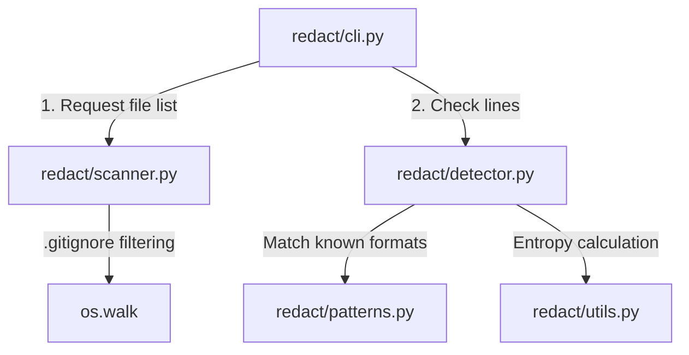

# Redact

Local command-line secret scanner that detects API keys, tokens, and credentials in source code before git commits.

## The Problem

Pasting an API key or database credential into source code during local development is a common mistake. If committed and pushed, those secrets become visible in public or shared repositories, leading to unauthorized resource usage, data exposure, or compromised infrastructure. Redact runs locally to identify secrets in your project files before code is published.

## Badges

[](https://github.com/shivrajpatare/Redact/actions/workflows/ci.yml)


## Quick Start

Clone the repository and install the package in editable mode:

```bash
git clone https://github.com/shivrajpatare/Redact.git
cd Redact
pip install -e ".[dev]"
```

Run a manual scan against the included demo directory:

```bash
redact scan --path tests/demo
```

Expected output:

```text
Starting Secret Scanner...

[HIGH] Potential AWS Access Key detected
  File: tests/demo/unsafe_code.py:10
  Secret: AK****************12

[HIGH] Potential OpenAI API Key (Approx) detected
  File: tests/demo/unsafe_code.py:16
  Secret: sk***********************************12

----------------------------------------
Scan Complete: 2 potential issues found.
```

## Installation

### Standalone Usage

Install directly from a local clone of the repository:

```bash
git clone https://github.com/shivrajpatare/Redact.git
cd Redact
pip install -e .
```

### Adding to Another Project

To run Redact inside an external project, clone Redact into a subdirectory and install it:

```bash
cd my-project
git clone https://github.com/shivrajpatare/Redact.git tools/Redact
pip install -e ./tools/Redact
```

Once installed, the `redact` command is available in your active Python environment. *(Note: `[dev]` dependencies like `pytest` are omitted here because end users integrating Redact into another project only require runtime dependencies.)*

## Usage

Redact provides two CLI commands via `click`: `scan` and `install-hook`.

### `redact scan`

Recursively scans files in a directory for secrets.

```bash
redact scan [OPTIONS]
```

Flags:
- `--path PATH`: Path to target directory (default: `.`).
- `--verbose`: Displays progress as each file is scanned.

Examples:

```bash
# Scan current directory
redact scan

# Scan a specific directory with verbose output
redact scan --path ./src --verbose
```

Exit codes:
- `0`: Scan completed cleanly with zero findings.
- `1`: One or more potential secrets were detected.

### `redact install-hook`

Installs a Git `pre-commit` hook in `.git/hooks/pre-commit` of the current repository.

```bash
redact install-hook
```

When installed, Git automatically runs `redact scan --path .` before every commit. If secrets are found, the commit process exits with code `1` and halts.

You can also run the scanner directly via `run.py`:

```bash
python run.py scan --path tests/demo
```

## Architecture



## Detection Pipeline

Redact analyzes files line-by-line using a two-stage evaluation engine in `redact/detector.py`.

### 1. Regex Pattern Engine
Each line is checked against pre-compiled regular expressions in `redact/patterns.py`. If a string matches a known provider format, a `HIGH` severity `Finding` is generated immediately.

### 2. Shannon Entropy & Context Engine
Lines that do not match a static regex pattern are evaluated for generic high-entropy strings:
1. **Context Keyword Check**: The line must match `(api[_-]?key|secret|password|token|auth|credential)` (case-insensitive). Lines without a context keyword skip entropy evaluation.
2. **String Extraction**: Quoted string literals (`"..."` or `'...'`) are extracted using regular expressions.
3. **Filtering**: Strings under 10 characters or containing spaces are ignored.
4. **Entropy Calculation**: Shannon entropy is calculated in `redact/utils.py` using $H = -\sum p(x) \log_2 p(x)$. If entropy exceeds `4.5`, a `MEDIUM` severity `Finding` is generated.

Secrets in output reports are masked, displaying only the first two and last two characters.

## Supported Secret Types

Redact detects 8 secret types using regex patterns in `redact/patterns.py`, plus generic secrets via entropy analysis.

| Secret Type | Detection Method | Notes |
| :--- | :--- | :--- |
| AWS Access Key | Regex | Matches prefixes `AKIA`, `ASIA`, `AROA`, `AIDA`, `AGPA`, `AIPA`, `ANPA`, `ANVA`, `A3TA` + 16 characters |
| GitHub Personal Access Token | Regex | Matches `ghp_` prefix followed by 36 alphanumeric characters |
| GitHub OAuth Access Token | Regex | Matches `gho_` prefix followed by 36 alphanumeric characters |
| Stripe Standard Live Key | Regex | Matches `sk_live_` prefix followed by 24 alphanumeric characters |
| OpenAI API Key (Approx) | Regex | Matches `sk-` prefix followed by 32 to 51 alphanumeric characters |
| Google API Key | Regex | Matches `AIza` prefix followed by 35 alphanumeric, hyphen, or underscore characters |
| Slack Bot Token | Regex | Matches `xoxb-` format with numeric and alphanumeric segments |
| Private Key Block | Regex | Matches `-----BEGIN (RSA\|DSA\|EC\|PGP\|OPENSSH) PRIVATE KEY-----` headers |
| High Entropy String | Entropy | Flagged when entropy > 4.5 on lines containing suspicious context keywords |

## Project Structure

```text
Redact/
├── .github/
│   └── workflows/
│       └── ci.yml
├── redact/
│   ├── __init__.py
│   ├── cli.py
│   ├── detector.py
│   ├── patterns.py
│   ├── scanner.py
│   └── utils.py
├── tests/
│   ├── demo/
│   │   ├── .gitignore
│   │   └── unsafe_code.py
│   ├── test_detector.py
│   ├── test_scanner.py
│   └── test_utils.py
├── .gitignore
├── pyproject.toml
├── README.md
├── requirements.txt
└── run.py
```

## Design Decisions

### Hybrid Detection Approach
Static regular expressions reliably detect structured provider keys (such as AWS or GitHub tokens) with low false positives. However, random passwords and unformatted API keys lack static prefixes. Combining regex pattern matching with Shannon entropy analysis allows Redact to flag unstructured secrets while using context keywords to limit false positives.

### Local and Offline Execution
Redact runs entirely on the host machine. No file contents or metadata are sent to external APIs or remote servers. This eliminates external network latency during scans and ensures sensitive code remains on local disk.

### Git Hook Integration
Manual CLI commands rely on developer discipline to run before every push. Installing a Git pre-commit hook automates verification at the git workflow boundary, blocking commits before secret-containing diffs enter local repository history.

## Limitations

- **Full repository scanning in pre-commit hook**: The `install-hook` command executes `redact scan --path .`, which scans the entire workspace rather than restricting the check to staged Git diffs (`git diff --cached`).
- **No finding deduplication**: A line matching both a regex pattern and the entropy threshold produces duplicate finding entries in the scan output.
- **No inline suppression comments**: There is no mechanism (such as `# redact:ignore`) to suppress false positives on specific lines.
- **Single-line detection scope**: The scanner evaluates files line-by-line. Multi-line credentials or private keys split across multiple lines are not evaluated across line breaks.

## Testing

Run the unit test suite using `pytest`:

```bash
pytest -v
```

Generate a test coverage report:

```bash
pytest --cov=redact --cov-report=term-missing
```

The test suite contains 14 tests across three modules:
- `tests/test_detector.py`: Validates regex pattern matching (AWS, Stripe, OpenAI, Google), entropy triggers, clean line pass-through, and secret masking output.
- `tests/test_scanner.py`: Validates `.gitignore` path exclusions, explicit `.git/` folder suppression, and directory pattern matching.
- `tests/test_utils.py`: Validates Shannon entropy calculations for empty, uniform, known-value, and high-entropy strings.

The test suite covers `detector.py` (94%), `scanner.py` (97%), `utils.py` (100%), and `patterns.py` (100%). Total statement coverage across `redact/` is 55% because `cli.py` entry point commands are tested via manual execution.

## License

MIT
